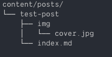

# Contribution Guide to TheCodeCousins

First of all, thank you for sharing your ideas, knowledge, opinions 🎉🎉 You are awesome and we love you 😍😍

❤️🧡💛💚💙💜🖤

The following is a set of guidelines for contributing to our blog.
We tried to be as comprehensive as possible, but if you feel that there is more to this, please feel free to propose changes to this in a pull request.

### Setting up local env

Start by forking this repository and then clone it recursively to your local workspace

```bash
git clone https://github.com/YOUR-USERNAME/thecodecousins --recursive
cd thecodecousins/
```

Check if you have [hugo](https://gohugo.io) installed by running `hugo version`.
If you haven't already installed [hugo](https://gohugo.io), please follow the instruction on [their site](https://gohugo.io/getting-started/installing/).

### Start a new post

Generate a new post from our theme template by running

```bash
hugo new posts/YOUR-POST-NAME/index.md # we will explain why index.md in the next section
```

Fill in all the necessary fields:

- title: try to keep it short and captivating.
- date: must be in [ISO-8601 format](https://en.wikipedia.org/wiki/ISO_8601), [this timestamp generator](https://timestampgenerator.com/) might come handy for such.
- author: your full/pen name. For a fancier post author, head down to [bonus section](#bonus)
- cover: image that will be shown in preview and at the top of your post
- tags: topics of your post
- keywords: same as tags but can be more specific
- description: a short summary of your post to be shown in preview
- showFullContent: please keep this as false to share blog's estate with other authors

Write your blog post in markdown with an enhanced flavor from [hugo](https://gohugo.io/).
If you are intending to do more than just standard mardown (md), checkout [hugo docs](https://gohugo.io/content-management/) to learn more.

### Static assets

We intend to use leaf bundle organisation for all posts on [TheCodeCousins](https://thecodecousins.com), which is the reason why you were asked to create a folder with your post name and an index.md for post content.
Your final product with some static assets would look something like this



Then your assets can be included in the post using the full path
(i.e. for the example, `/test-posts/img/cover.jpg` is the needed path to include the cover image).

### Letting us know 🎉🎉

After you are done with your post, please open a [Pull Request](https://github.com/thecodecousins/thecodecousins/compare) on our repository and your post will be up in no time. 🥳🥳

### Doubts and questions

Please shoot us [a new issue](https://github.com/thecodecousins/thecodecousins/issues/new) labelled `question` on [our repo](https://github.com/thecodecousins/thecodecousins).

### <a name="bonus" id="bonus"></a> Bonus: Author field with metadata

This section is for anyone who's looking for a fancier `Author` field at the top of their post instead of just a plain string.

Create an author data for yourself, we recommend using your Github handle as an identifier for consistency and to avoid collision among our contributors

```bash
touch data/authors/YOUR-USERNAME.yml
```

There are 3 fields that you can provide in your author data file:

- name: self-explanatory 😁😆
- url: link to your online profile
- bio: short intro of yourself, please keep it under 50 characters

Use the corresponding identifier as the `author` field for your post. (i.e., my author data file is `stanleynguyen.yml` then my post's `author` field should be `stanleynguyen`)
